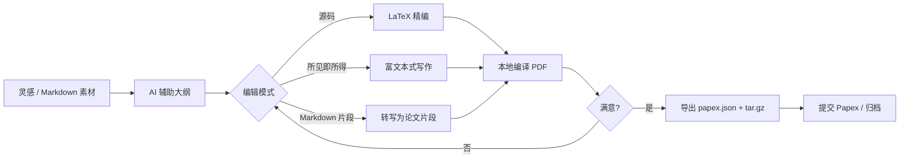
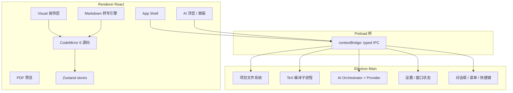

# Papex Writer 项目方案

> 论文创意与编辑软件 · Papex 生态附属项目
>
> 文档状态：**v1.1 定稿（实施基线）**
> 编写日期：2026-02-18
> 本版新增：Overleaf 功能借鉴、全流程 AI、源码/所见即所得双模编辑、Markdown 片段转论文片段
> 上游依赖：[papex](https://github.com/Maicarons/papex) · [papex-latex](https://github.com/Maicarons/papex/tree/main/papex-latex)
> 参考实现：[overleaf/overleaf](https://github.com/overleaf/overleaf)（AGPL，仅作功能与架构参考，不复制代码）

---

## 目录

1. [项目定位](#1-项目定位)
2. [目标用户与核心场景](#2-目标用户与核心场景)
3. [Overleaf 功能研究与借鉴](#3-overleaf-功能研究与借鉴)
4. [功能范围](#4-功能范围)
5. [全流程 AI 架构](#5-全流程-ai-架构)
6. [双模编辑与 Markdown 转写](#6-双模编辑与-markdown-转写)
7. [与 Papex 生态的关系](#7-与-papex-生态的关系)
8. [技术选型](#8-技术选型)
9. [界面设计规范](#9-界面设计规范)
10. [系统架构](#10-系统架构)
11. [数据模型](#11-数据模型)
12. [papex-latex 集成](#12-papex-latex-集成)
13. [仓库与目录结构](#13-仓库与目录结构)
14. [文档体系（VitePress）](#14-文档体系vitepress)
15. [工程化与质量保障](#15-工程化与质量保障)
16. [打包与发布](#16-打包与发布)
17. [里程碑计划](#17-里程碑计划)
18. [风险与对策](#18-风险与对策)
19. [验收标准](#19-验收标准)

---

## 1. 项目定位

**Papex Writer** 是 Papex 学术文献平台的**桌面端论文创作与编辑工具**。它面向「灵感 → 大纲 → 正文 → 可编译稿件 → Papex 投稿包」的完整写作链路，以 **papex-latex** 为唯一的排版与构建契约，输出与 Papex 平台完全兼容的 `submission.tar.gz`。

一句话定位：

> **本地优先、AI 全程辅助的学术写作工作台**——创意收集、结构编排、源码/所见即所得双模 LaTeX 精编、Markdown 素材转论文片段、实时预览、一键导出 Papex 投稿包。

### 1.1 设计原则

| 原则 | 含义 |
|------|------|
| **契约一致** | 一切元数据以 `papex.json`（schema v1.0.0）为唯一真相源，不另造私有格式 |
| **本地优先** | 创作数据全部落在本地项目目录；不登录也能完整写作与导出 |
| **界面同源** | 设计令牌、组件形态、交互密度与 papex 网页端保持同一视觉语言 |
| **单源编辑器** | 源码与所见即所得共享同一文档模型（CodeMirror），所见即所得是源码的投影，而非另一份真相 |
| **AI 可插拔、可关闭** | 全流程 AI 辅助，但每一步可单独关闭；支持本地模型/自定义端点；不用用户数据训练 |
| **可离线编译** | 依赖本机 TeX Live / MiKTeX 完成 PDF 构建，不强制云端 |
| **Win10 基线** | Electron 支持 Windows 10 及以上；macOS / Linux 作为并行一等公民 |

### 1.2 非目标（明确不做）

- 不做 Papex 平台的管理/审核/运营功能（用网页端）
- 不做通用 Markdown 笔记软件（专注学术论文创作；Markdown 仅作为**输入/转写**通道）
- 不做云端实时协作 v1（单机 + 本地修订/批注；实时协作留给 papex co-review / 未来 P2）
- 不强制捆绑闭源 AI 云服务（本地/自定义端点优先）

---

## 2. 目标用户与核心场景

### 2.1 目标用户

1. **研究生 / 科研人员**：需要反复调结构、写完整 LaTeX 稿并投 Papex
2. **课程论文 / 学位论文作者**：依赖 papex.cls 中英混排模板快速出规范 PDF
3. **从 Markdown / Word 迁移的作者**：习惯富文本或 Markdown，希望一键转成论文结构
4. **Papex 平台作者**：希望有比网页 Writespace 更强的桌面编辑体验

### 2.2 核心场景（用户旅程）



| 场景 | 关键能力 |
|------|----------|
| 灵感碎片管理 | 创意收件箱、标签、AI 提炼研究问题、升格为章节 |
| 论文结构设计 | 章节树拖拽、AI 大纲建议、模板骨架 |
| 正文精修 | **源码 / 所见即所得双模**、snippet、补全、AI 改写润色 |
| 外部素材进入 | **Markdown/HTML/Word 粘贴 → 论文片段**、表格/公式生成 |
| 引用管理 | BibTeX 库、cite 补全、DOI/arXiv 导入、AI 推荐引用位置 |
| 版式精调 | 一键编译、PDF 并排预览、错误 AI 解释与跳转 |
| 交付导出 | papex 投稿包、PDF、合规预检（含 AI 检查清单） |

---

## 3. Overleaf 功能研究与借鉴

> 调研对象：`overleaf/overleaf` 开源仓库（Community Edition，AGPL-3.0）+ 官方产品文档。
> **结论**：借鉴其功能设计与模块划分；**不复制其 AGPL 源码**。实现层用我们自己的 TypeScript 模块。

### 3.1 源码级发现（模块映射）

| Overleaf 模块（源码路径） | 作用 | Papex Writer 借鉴 |
|--------------------------|------|-------------------|
| `libraries/overleaf-editor-core` | 文档模型 / OT 操作 | 自研轻量文档模型（CodeMirror 6 文档即可，本地单用户无需完整 OT） |
| `libraries/ranges-tracker` | 批注 / 修订（tracked changes）的 range 同步 | **本地修订与批注**：插入/删除 range + 批注线程 + 接受/拒绝 |
| `services/web/.../source-editor` | CodeMirror 6 编辑器 | **同选 CodeMirror 6** 作为唯一编辑内核 |
| `source-editor/lezer-latex` | LaTeX 语法树 | 采用/重写 lezer-latex 高亮与解析 |
| `source-editor/extensions/visual` | **所见即所得 = 源码上的装饰层** | **核心借鉴**：Visual 模式不是第二套文档，而是 decorations 投影 |
| `source-editor/extensions/visual/paste-html.ts` | HTML/Word 粘贴 → LaTeX | 粘贴转换（配合 Markdown 转写） |
| `source-editor/extensions/visual/table-generator.ts` | 表格生成器 | 表格生成面板 |
| `source-editor/languages/markdown` | Markdown + Math 语言 | **Markdown 片段转论文片段**的底层语言支持 |
| `source-editor/languages/latex/*` | 补全 / lint / snippet / 大纲 / 缩进 | cite/ref/env/label 补全、结构大纲、snippet、缩进 |
| `features/command-palette` | 命令面板 | 命令面板（`Ctrl+Shift+P`） |
| `features/outline` | 文档大纲 | 大纲面板 + 跳转 |
| `features/pdf-preview` + `ide/log-parser` | PDF 预览与人类可读日志 | PDF 预览 + **错误日志解析/人话化**（可再加 AI 解释） |
| `features/history` | 版本历史 / 标签 / 对比 / 恢复 | **本地快照**：标签、对比、恢复 |
| `features/bibtex` | BibTeX 解析、citation key | 文献解析与 key 管理 |
| `features/review-panel` / `features/chat` | 批注与讨论 | 本地批注线程（单机）；聊天不做 v1 |
| `features/file-tree` | 多文件树 | 项目文件树（sections/assets） |
| `features/dictionary` | 拼写检查 | hunspell/系统词典拼写检查 |
| `features/word-count-modal` | 字数统计 | 字数/页数统计 |
| `features/preview` + `mathjax` | 公式预览 | 行内公式即时预览 |
| `services/clsi` | 编译服务 | 本地 `latexmk`/`xelatex` 编译管线（对齐 papex-latex） |
| `services/git-bridge` | Git 集成 | 项目目录天然 Git 友好；可选 Git 面板（P2） |
| Writefull / TeXGPT 集成 | AI 语言润色 / LaTeX 辅助 | **自研可插拔 AI 层**（见第 5 节） |

### 3.2 功能借鉴清单（按优先级）

**直接进入 P0/P1 的能力**

| 能力 | 说明 | 优先级 |
|------|------|--------|
| 源码编辑器 | CodeMirror 6 + LaTeX/Markdown 高亮 | P0 |
| 所见即所得 Visual 模式 | 源码装饰层投影，可与源码一键切换 | P0 |
| Markdown 片段转论文片段 | 粘贴/导入/选区转换为章节级 LaTeX | P0 |
| 智能补全 | `\cite` / `\ref` / 环境 / 标签 / 包名 | P0 |
| 文档大纲 | 章节结构树、点击跳转、拖拽重排 | P0 |
| 编译 + PDF 预览 | 本地 TeX、错误列表、点击跳行 | P0 |
| 片段（Snippet） | 定理、表格、图、算法等一键插入 | P0 |
| 命令面板 | 全功能可达、模糊搜索 | P0 |
| 批注与修订 | 选区批注、插入/删除修订、接受/拒绝 | P1 |
| 版本快照 | 命名标签、时间线、对比、恢复 | P1 |
| 表格生成器 | 可视化表格 → LaTeX tabular | P1 |
| 粘贴转换 | HTML/Word 粘贴 → LaTeX | P1 |
| BibTeX 解析增强 | 从 .bib 导入、key 冲突检测 | P1 |
| 公式面板 / 符号面板 | 数学符号点选插入 | P1 |
| 拼写检查 | 词典 + 可选 AI 拼写语法 | P1 |
| 字数统计 | 章节/全文、字符、预计页数 | P1 |
| 模板市场（本地） | 期刊/学位论文模板包 | P1 |
| Git 状态面板 | 显示 diff / 提交快捷操作（调用系统 git） | P2 |
| 比较两版本 PDF | 版本对比 | P2 |

**明确不借鉴 / 延后**

| Overleaf 能力 | 处理 |
|---------------|------|
| 云端实时多人 OT 协作 | 不做 v1；数据模型预留 range 结构以便未来扩展 |
| 服务器编译集群 CLSI | 本地编译即可；P2 可选远程编译 |
| 订阅付费墙 / 机构 SSO | 与桌面单机无关 |
| 其聊天室 | 用本地批注代替 |

### 3.3 借鉴的架构要点

1. **Visual 不是独立编辑器**：Overleaf 用 CodeMirror decoration / projection 在源码上呈现富文本。Papex Writer 采用同一思路——**源码是唯一真相，所见即所得是投影**，避免双源同步灾难。
2. **ranges-tracker 思想**：批注与修订是附加在文档位置上的 range 集合，随编辑漂移。本地实现同样用「锚点 + 偏移修正」。
3. **补全/大纲/命令来自语法树**：lezer-latex 解析出 section/cite/ref/env，驱动补全与大纲，而不是正则瞎猜。
4. **日志人话化**：`human-readable-logs` + `log-parser`——编译错误先机器解析，再（可选）AI 解释。

---

## 4. 功能范围

优先级：P0 = MVP 必须；P1 = 1.x 完善；P2 = 后续探索。

### 4.1 P0 —— 创作与编辑核心

| 模块 | 功能点 |
|------|--------|
| **项目管理** | 新建（空白/模板/示例/从 tar.gz 导入）；项目目录打开；自动保存与崩溃恢复 |
| **创意库** | 灵感收件箱、标签、检索；升格为章节草稿；**AI 提炼研究问题/贡献点** |
| **大纲 / 章节树** | 增删拖拽、层级控制、与 `papex.json.sections[]` 双向同步 |
| **源码编辑器** | CodeMirror 6；LaTeX/Markdown 高亮、折叠、多光标、查找替换、跳转 |
| **所见即所得** | Visual 模式：标题/加粗/斜体/列表/表格/图/公式可视化编辑，一键切源码 |
| **Markdown 转写** | 粘贴/导入 `.md` → 章节 LaTeX；保留标题层级、列表、表格、代码块、行内/块级公式 |
| **智能补全** | cite key、`\ref`/`\label`、环境、包名、文件路径 |
| **元数据编辑** | `papex.json` 全字段表单 + schema 实时校验 |
| **参考文献** | 文献 CRUD、BibTeX 导入导出、`\cite{}` 插入 |
| **编译预览** | 本地 latexmk；pdf.js 预览；错误面板跳转；**AI 解释报错** |
| **AI 写作辅助** | 选区润色/扩写/缩写/学术化；续写建议（可关） |
| **导出** | `submission.tar.gz`、PDF、校验预检 |
| **设计系统** | papex 同款 tokens / 组件 / 深浅色 / 中英 |

### 4.2 P1 —— 效率增强

| 模块 | 功能点 |
|------|--------|
| 批注与修订 | 选区批注、tracked insert/delete、接受/拒绝、批注解决 |
| 版本快照 | 时间线、命名标签、文本对比、一键恢复 |
| 表格 / 公式生成 | 可视化表格编辑器；文本或图片 → LaTeX 表/公式（含 AI） |
| 粘贴转换 | Word/网页 HTML 粘贴 → LaTeX |
| snippet 包 | 定理/算法/图/表模板；用户自定义 |
| 引用增强 | DOI/arXiv 元数据抓取；GB/T 7714 / APA 预览；**AI 推荐引用位置** |
| 拼写语法 | 词典检查 + AI 学术语法建议 |
| 写作统计 | 字数/章节分布/写作时长 |
| 图表资源 | 项目图片库、拖入即插入 |
| i18n | 界面 zh-CN / en-US 完整 |
| 模板 | 本地模板包（期刊/学位/课程） |

### 4.3 P2 —— 生态与智能

| 模块 | 功能点 |
|------|--------|
| Papex 云对接 | API Key、分类树、投稿包上传、草稿同步 |
| 本地大模型 | Ollama / OpenAI 兼容端点；离线 AI 全流程 |
| 全文检索 | 项目内检索（MiniSearch） |
| Git 面板 | 状态/diff/提交（调用系统 git） |
| 远程编译 | 可选连 Papex 服务端编译 |
| 插件 | snippet 包、导出器、AI 提示词包扩展点 |

---

## 5. 全流程 AI 架构

> 目标：从「有 AI 按钮」升级为「每一步都能借力 AI，且每一步都能关掉」。

### 5.1 AI 能力矩阵（写作流水线 × AI）

| 阶段 | AI 能力 | 实现形态 | 默认 |
|------|---------|----------|------|
| **灵感** | 研究问题生成、贡献点提炼、关键词扩展 | 侧栏「AI 灵感」 | 开 |
| **大纲** | 章节结构建议、从摘要生成大纲、章节字数配比建议 | 大纲面板操作 | 开 |
| **素材转写** | Markdown/笔记 → 论文级学术段落（保结构、升语体） | 转写面板 | 开 |
| **写作中** | 续写建议、选区润色/扩写/缩写、中英互译、学术化改写 | 浮动菜单 / 命令面板 | 续写关，润色开 |
| **LaTeX** | 表/公式生成（文本或截图）、环境包裹、命令补全解释 | 面板 + 补全 | 开 |
| **纠错** | 编译错误解释与一键修复建议、语法/用词（Writefull 式） | 编译面板 / 波浪线 | 开 |
| **引用** | 推荐引用位置、生成 BibTeX 条目草稿、相关工作段落建议 | 文献面板 | 关（需联网/模型） |
| **摘要** | 从全文生成/打磨摘要、标题建议、关键词 | 元数据页 | 开 |
| **审阅** | 一致性检查、图表引用缺失、术语统一、摘要-结论对齐 | 「AI 审阅」报告 | 开 |
| **导出预检** | papex.json 合规、缺图缺引、语言提示 | 导出向导 | 开 |

### 5.2 架构

```text
┌─────────────────────────────────────────────────────────┐
│                    AI Orchestrator（src/main/ai）         │
│  会话管理 · 提示词模板 · 流式输出 · 预算/限流 · 审计日志      │
└───────────────┬─────────────────────────┬───────────────┘
                │                         │
     ┌──────────▼──────────┐   ┌──────────▼──────────┐
     │ Provider 适配层      │   │ 上下文构建器         │
     │ · OpenAI 兼容 HTTP   │   │ · 选区/章节/大纲     │
     │ · Anthropic 兼容     │   │ · papex.json 元数据  │
     │ · Ollama 本地        │   │ · 编译日志           │
     │ · 自定义 baseURL     │   │ · 文献上下文         │
     └─────────────────────┘   └─────────────────────┘
```

**策略**

| 策略 | 说明 |
|------|------|
| 可插拔 Provider | OpenAI 兼容 / Anthropic / Ollama / 用户自定义；设置页配置 |
| 本地优先 | 默认尝试 Ollama 或用户配置端点；无端点则 AI 功能显式禁用 |
| 隐私 | 不把全文默认外发；调用前展示「将发送的上下文范围」；支持「仅发送选区」；不用用户数据训练（对齐 Overleaf AI 承诺） |
| 可关闭 | 全局 AI 开关 + 每类能力独立开关；学术诚信场景可一键「AI 仅辅助结构」 |
| 流式 | 所有生成类能力流式输出，可中断 |
| 可解释 | 生成结果可「采纳 / 复制 / 插入 / 丢弃」，不直接覆盖原文（修订模式除外） |
| 本地规则引擎 | Markdown 转写、LaTeX 错误解析等**规则优先**，AI 仅在规则不足时增强 |

### 5.3 提示词工程

- 提示词模板版本化（`packages/ai-core/prompts/*.md`），与代码同仓库评审
- 中英双语提示词；按用户界面语言自动选择
- 输出约束：LaTeX 片段必须可编译；学术文本禁止口语化；保留 `\cite{}` 不改 key
- 负面清单：不编造引用、不改数学符号语义、不删除作者论点

---

## 6. 双模编辑与 Markdown 转写

### 6.1 三通道输入，单一文档真相

```text
        ┌──────────────┐   ┌──────────────┐   ┌──────────────────┐
        │  源码编辑     │   │ 所见即所得    │   │ Markdown 粘贴/导入 │
        │  (CodeMirror) │   │  (Visual)    │   │  (MD → LaTeX)     │
        └──────┬───────┘   └──────┬───────┘   └────────┬─────────┘
               │                  │                     │
               │    decorations   │                     │  转写引擎
               │◄─────────────────┤                     │
               │                  │                     │
               └──────────►───────┴──────────►──────────┘
                              │
                              ▼
                    CodeMirror Document（唯一真相）
                              │
                              ▼
                    sections/*.tex + papex.json
```

**源码 ↔ 所见即所得**：同一 CodeMirror 文档。Visual 模式通过 decoration/projection 呈现标题、强调、列表、表格、图、公式；编辑操作写回源码文本。切换模式**不改变文档内容**，只改变呈现与键位。

> 该架构直接借鉴 Overleaf `source-editor/extensions/visual`：Visual 是源码的投影层，而不是第二套文档模型。

### 6.2 Visual 模式能力（P0 起）

| 元素 | Visual 表现 | 源码形态 |
|------|-------------|---------|
| 标题 | 大号粗体段落，可选级别 | `\section{}` / subsection… |
| 强调 | 所见即所得加粗/斜体 | `\textbf{}` `\emph{}` |
| 列表 | 项目符号 / 编号 | `itemize` / `enumerate` |
| 表格 | 网格编辑（P1 表格生成器） | `tabular` |
| 图 | 缩略图占位，拖拽替换 | `\includegraphics` |
| 公式 | 即时排版预览 | `$...$` / `\[...\]` / `equation` |
| 引用 | 「作者 (年份)」徽标，点击跳文献 | `\cite{key}` |
| 脚注 | 上标 + 气泡 | `\footnote{}` |
| 不支持结构 | 半透明源码芯片（点开源码） | 任意复杂命令 |

**切换**：工具栏开关 / `Ctrl+Shift+V`；命令面板「切换视觉模式」。

### 6.3 Markdown 片段 → 论文片段

**目标**：把 Markdown 素材（笔记、Obsidian、GitHub、Chat 输出）快速变成符合 papex-latex 的论文片段，而不是简单贴进 `\texttt{}`。

**转换规则引擎（规则优先）**

| Markdown | 论文 LaTeX |
|----------|-----------|
| `#` / `##` / `###` | `\section` / `\subsection` / `\subsubsection` |
| `**bold**` / `*em*` / `~~strike~~` | `\textbf` / `\emph` / `\sout` |
| `-` / `1.` 列表 | `itemize` / `enumerate` |
| 表格（GFM） | `booktabs` 三线表 |
| 行内代码 | `\texttt{}` |
| 代码块 | `verbatim` / `minted`（可选） |
| `$...$` / `$$...$$` | 行内/行间公式（原样保留） |
| `` | `\begin{figure}\includegraphics...\caption{alt}` |
| `[text](url)` | `\href{url}{text}` 或脚注 |
| 引用块 `>` | `quote` 或强调段落 |
| 水平线 `---` | `\bigskip` / 注释分隔 |
| 任务列表 | 枚举 + 批注（不直接进正文） |

**AI 增强（规则不足时）**

- 语体升格：口语 → 学术书面语（可选）
- 结构建议：把「笔记型」MD 建议重组为「问题-方法-结果-结论」
- 术语统一与中英混排修正
- 生成过渡句（可选，标注为 AI 建议）

**入口**

1. 全局粘贴：检测 `text/markdown` 或连续 MD 语法 → 弹「转写为论文片段」
2. 菜单「导入 Markdown…」：`.md` 文件 → 新章节或指定章节
3. 选区「转写为论文片段」：把已粘贴的 MD 转掉
4. 创意库条目「转为章节草稿」

**产物**：直接写入目标 `sections/*.tex`；可先预览 Diff 再插入（安全）。

### 6.4 编辑器相关补全（LaTeX 智能）

借鉴 Overleaf `languages/latex/completions`：

| 类型 | 触发 | 数据源 |
|------|------|--------|
| `\cite{` | cite key | `papex.json.references` + `references.bib` |
| `\ref{` `\eqref{` | label | 当前章节树扫描 |
| `\begin{` | 环境名 | 常用环境 + 文档类已加载包 |
| `\usepackage{` | 包名 | TeX 发行版索引（可选） |
| `\includegraphics{` | 路径 | 项目 `assets/` |
| 文件 `\input{` | 路径 | `sections/` |

---

## 7. 与 Papex 生态的关系

```text
                    ┌─────────────────────┐
                    │   Papex 平台 (Web)   │
                    │  文献库 / 投稿 / 同行 │
                    └──────────▲──────────┘
                               │ submission.tar.gz
                               │ （papex.json 契约）
                    ┌──────────┴──────────┐
                    │   Papex Writer      │
                    │  桌面创作与编辑 + AI  │
                    └──────────▲──────────┘
                               │ 调用模板与构建语义
                    ┌──────────┴──────────┐
                    │   papex-latex       │
                    │  papex.cls / schema │
                    │  / 构建片段生成      │
                    └─────────────────────┘
```

| 上游资产 | 在 Writer 中的使用方式 |
|----------|------------------------|
| `papex.schema.json` | 项目元数据校验的唯一 Schema（AJV） |
| `papex.cls` / `papex-template.tex` | 内置为应用资源；编译与导出时写入项目 |
| `papex-build.py` 片段生成语义 | 移植为 TypeScript（`@papex-writer/latex-core`） |
| papex `writespace/latex-gen.ts` | **直接对齐**转义与片段生成算法 |
| papex UI（globals.css / shadcn） | 设计令牌与组件 1:1 对齐 |

**兼容承诺**：Writer 导出的 `submission.tar.gz` 必须可被 Papex 平台 `submit/archive` 直接接受。

---

## 8. 技术选型

### 8.1 总览

| 层 | 选型 | 版本基线 | 理由 |
|----|------|----------|------|
| 桌面壳 | **Electron** | 33.x（Win10+） | 用户要求；Electron 23+ 即不支持 Win7/8 |
| 打包 | electron-builder | 25.x+ | NSIS/MSI、DMG、AppImage |
| 渲染层 | **React 19 + TypeScript 5.9** | 与 papex 同款 | |
| 构建 | Vite 6 + electron-vite | — | HMR 与文档工具链一致 |
| 样式 | **Tailwind CSS 4** | 4.x | papex 同款 tokens |
| 组件 | shadcn/ui（Radix + CVA） | Radix 1.x | 与 papex `ui/*` 同构 |
| 图标 | lucide-react | 与 papex 同款 | |
| 状态 | Zustand | 5.x | |
| 编辑器 | **CodeMirror 6** | 6.x | Overleaf 同源选择；装饰层可做 Visual 模式 |
| LaTeX 语法 | **lezer-latex**（或等价自定义） | — | 语法树驱动补全/大纲/Visual |
| Markdown | `@codemirror/lang-markdown` + GFM/数学扩展 | — | MD 转写与 MD 章节编辑 |
| PDF 预览 | pdf.js | 4.x | |
| 校验 | Zod + AJV | Zod 4 / AJV 8 | |
| AI | 自研 `ai-core` + fetch 流式（OpenAI 兼容/Ollama/Anthropic） | — | 可插拔、可离线 |
| 测试 | Vitest + Playwright | 与 papex 同款 | |
| 文档 | **VitePress** | 1.6+ | |
| Lint/Format | ESLint 9 + Prettier 3 | 与 papex 同款 | |

### 8.2 Electron 与 Win10 策略

- **最低系统**：Windows 10 x64 / macOS 11+ / 现代 Linux
- Electron 33.x；若上游放弃 Win10，锁定最后支持版本维护安全补丁

### 8.3 本地 TeX 依赖

| 依赖 | 探测 | 降级 |
|------|------|------|
| TeX Live / MiKTeX | PATH + 设置页指定 | 无 TeX 可编辑/导出；编译按钮给安装指引 |
| 中文字体 | `build.fontset` 随平台 | 与 papex.cls 选项一致 |

### 8.4 AI 依赖

| 依赖 | 必需性 | 说明 |
|------|--------|------|
| 本地规则引擎 | 必需 | MD 转写、日志解析、补全 |
| 任一 LLM 端点 | 可选 | 无端点时 AI 功能禁用，其余完整可用 |
| 网络 | 可选 | DOI 导入、远程模型 |

---

## 9. 界面设计规范

**风格锚点**：与 papex 网页端同源——沉稳靛蓝学术工作台。参考气质 = Linear / Notion 的密度克制 + papex 品牌蓝 + 学术出版的清晰排版。

### 9.1 色彩（与 papex `globals.css` 1:1）

| 令牌 | Light | Dark | 用途 |
|------|-------|------|------|
| `--background` | `0 0% 100%` | `222 47% 7%` | 应用底 |
| `--foreground` | `222 47% 11%` | `210 40% 96%` | 正文 |
| `--primary` | `224 76% 40%` | `217 91% 65%` | 主操作、选中 |
| `--secondary` | `217 91% 60%` | 同左 | 次强调 |
| `--muted` | `214 100% 97%` | `217 33% 17%` | 面板底 |
| `--accent` | `214 100% 95%` | `217 33% 20%` | hover |
| `--cta` | `142 71% 45%` | `142 71% 50%` | 编译 / 导出 |
| `--destructive` | `0 72% 51%` | 同左 | 危险操作 |
| `--radius` | `0.6rem` | 同左 | 全局圆角 |

品牌辅助（PDF/图表）：`papexblue #1D4E89`、`papexgrey #6E747C`、`papexline #C8CDD4`。
AI 相关 UI：以 `--secondary` 高亮 + ✦ 图标标识，避免喧宾夺主。

### 9.2 字体

| 用途 | 字体 |
|------|------|
| UI 正文 | `Open Sans` |
| UI 标题 | `Poppins` |
| 中文回退 | `Microsoft YaHei` / `PingFang SC` |
| 编辑器 | `JetBrains Mono` / `Cascadia Code` / `Consolas` |

### 9.3 布局系统

```text
┌──────────────────────────────────────────────────────────────┐
│  工具栏：项目名 · 源码|Visual 切换 · 编译 · AI · 导出 · 主题     │
├──────────┬───────────────────────────────────┬───────────────┤
│ 左侧导航  │           主工作区                  │   右侧检查器   │
│ 240–280px│  CodeMirror / Visual / 表单        │  280–380px    │
│          │                                   │ 大纲|PDF|文献  │
│ · 项目   │                                   │ |AI|批注       │
│ · 创意库 │                                   │               │
│ · 章节树 │                                   │               │
│ · 文献库 │                                   │               │
│ · 设置   │                                   │               │
└──────────┴───────────────────────────────────┴───────────────┘
```

- 最小窗口 1100×700；推荐 1440×900
- 间距 4px 基数；面板内边距 16px
- 命令面板居中浮层（Overleaf 式）

### 9.4 关键界面

| 界面 | 说明 |
|------|------|
| 欢迎页 | 最近项目、新建（空白/模板/示例/tar.gz）、导入 Markdown |
| 工作台 | 三栏；编辑器双模；右侧可切换大纲/PDF/文献/AI/批注 |
| Visual 工具栏 | 标题、加粗、斜体、列表、表格、图、公式、引用 |
| Markdown 转写向导 | 预览 Diff → 选择目标章节 → 插入 |
| AI 浮动菜单 | 润色/扩写/缩写/学术化/解释/翻译 |
| 编译面板 | 进度、人类可读错误、「AI 解释」按钮 |
| 导出向导 | 预检清单（含 AI 审阅摘要）→ 产物预览 → 生成 |

---

## 10. 系统架构

### 10.1 进程模型



**安全基线**：`contextIsolation: true`、`nodeIntegration: false`、IPC 白名单；文件读写限制在项目根；AI 请求可代理到主进程以便审计。

### 10.2 模块划分

| 模块 | 位置 | 职责 |
|------|------|------|
| `app-shell` | `src/renderer/shell` | 布局、主题、i18n、命令面板 |
| `project` | `src/{main,renderer}/project` | 打开/保存、监视、最近列表 |
| `ideation` | `features/ideation` | 创意库 + AI 灵感 |
| `outline` | `features/outline` | 章节树 ↔ papex.json |
| `editor-source` | `features/editor` | CodeMirror、补全、snippet、lint |
| `editor-visual` | `features/editor/visual` | Visual 装饰层、格式工具栏 |
| `md-convert` | `features/editor/md-convert` | Markdown → LaTeX 转写 |
| `meta` | `features/meta` | 元数据 + schema |
| `refs` | `features/refs` | 文献库、BibTeX、cite |
| `compile` | `main/tex` + `features/compile` | 编译、日志解析、PDF |
| `review` | `features/review` | 批注、修订（P1） |
| `export` | `main/export` + `features/export` | tar.gz / PDF / zip |
| `ai-core` | `packages/ai-core` | Provider、提示词、上下文、流式 |
| `latex-core` | `packages/latex-core` | 转义、片段、归档、schema |

### 10.3 编译流水线

```text
编辑器内容 ──保存──► papex.json + sections/*.tex
                        │
                        ▼
              latex-core.generateArtifacts()
              _papex_*.tex / references.bib
                        │
                        ▼
              latexmk -xelatex papex-template.tex
                        │
                        ▼
              build/*.pdf ──► pdf.js
              build/*.log ──► log-parser ──► 错误列表
                                           └─► AI 解释（可选）
```

---

## 11. 数据模型

### 11.1 项目目录

```text
my-paper/
├── papex.json
├── papex-template.tex
├── references.bib
├── sections/
│   └── *.tex
├── assets/
├── .papex-writer/
│   ├── project.json          # 创意、UI 状态、AI 开关、快照索引
│   ├── build/                # 编译输出
│   ├── snapshots/            # 版本快照
│   └── review/               # 批注与修订 range（P1）
└── submission.tar.gz
```

### 11.2 `papex.json`

严格遵循上游 `papex.schema.json`（draft-07，`schemaVersion` = `1.0.0`）。

### 11.3 Writer 私有扩展（`.papex-writer/project.json`）

```jsonc
{
  "writerVersion": "0.1.0",
  "ideas": [
    {
      "id": "uuid",
      "title": "…",
      "body": "…",
      "tags": ["method"],
      "status": "inbox" | "linked" | "archived",
      "targetSectionId": "01-method",
      "createdAt": "…",
      "updatedAt": "…"
    }
  ],
  "editor": {
    "mode": "source" | "visual",
    "ai": {
      "enabled": true,
      "provider": "ollama" | "openai-compatible" | "anthropic" | "custom",
      "features": { "continuation": false, "polish": true, "review": true }
    }
  },
  "review": {
    "comments": [{ "id": "…", "section": "01-method", "from": 120, "to": 180, "thread": [], "resolved": false }],
    "changes": [{ "id": "…", "type": "insert" | "delete", "section": "…", "from": 0, "to": 0, "text": "…" }]
  },
  "ui": { "sidebarWidth": 260, "activeRightTab": "outline" },
  "snapshots": [{ "id": "uuid", "label": "v1 初稿", "createdAt": "…" }]
}
```

该文件**不进入**投稿包。

### 11.4 批注 / 修订 range（借鉴 ranges-tracker）

- 每条批注/修订携带 `section` + 字符偏移 `from/to`
- 编辑时用简易 OT/锚点算法随插入删除漂移（本地单用户，无需多人 OT）
- 接受修订 = 写回源码；拒绝 = 移除 range
- 未来若接 Papex 协作，可升级为完整 ranges-tracker 语义

---

## 12. papex-latex 集成

### 12.1 资源内置

| 文件 | 内置位置 |
|------|----------|
| `papex.cls` | `resources/latex/papex.cls` |
| `papex-template.tex` | `resources/latex/papex-template.tex` |
| `papex.schema.json` | `resources/latex/papex.schema.json` |
| `latexmkrc` | `resources/latex/latexmkrc` |
| `example/` | `resources/latex/example/` |

同步：`npm run sync:latex`；契约：`npm run verify:example`。

### 12.2 构建语义（`packages/latex-core`）

与 papex 网页 `src/lib/writespace/latex-gen.ts` **同构**：

| API | 说明 |
|-----|------|
| `latexEscape` / `bibtexEscape` | 单遍转义 |
| `genMeta` / `genAbstract` / `genSections` / `genBackmatter` / `genAppendices` | `_papex_*.tex` |
| `genBib` | references → BibTeX |
| `applyTemplateOptions` | bibStyle / columns |
| `buildArchiveFiles` | 归档清单 |
| `validateManifest` | AJV 校验 |

### 12.3 本地编译

```ts
spawn(latexmkPath, ["-xelatex", "-interaction=nonstopmode", "papex-template.tex"], {
  cwd: buildDir,
  env: sanitizedEnv, // 无 shell-escape
});
```

---

## 13. 仓库与目录结构

```text
papex-writer/
├── .github/
│   ├── ISSUE_TEMPLATE/
│   ├── PULL_REQUEST_TEMPLATE.md
│   └── workflows/          # ci.yml / docs.yml / release.yml
├── docs/                   # VitePress
│   ├── .vitepress/config.ts
│   ├── public/
│   ├── index.md
│   ├── guide/              # 含 ideation / dual-edit / md-convert / ai
│   ├── reference/
│   └── zh/
├── packages/
│   ├── latex-core/         # papex-latex 语义
│   ├── ai-core/            # Provider、提示词、上下文、流式
│   ├── md-to-latex/        # Markdown → LaTeX 规则引擎
│   └── shared/             # 类型、IPC、i18n
├── src/
│   ├── main/               # 窗口、菜单、ipc、project、tex、export、ai
│   ├── preload/
│   └── renderer/
│       ├── shell/
│       ├── components/ui/
│       ├── features/
│       │   ├── welcome/
│       │   ├── ideation/
│       │   ├── outline/
│       │   ├── editor/           # 源码
│       │   │   └── visual/       # 所见即所得装饰层
│       │   ├── md-convert/       # 转写 UI
│       │   ├── meta/
│       │   ├── refs/
│       │   ├── compile/
│       │   ├── review/           # 批注修订
│       │   ├── ai/               # AI 浮层与面板
│       │   └── export/
│       ├── stores/
│       └── styles/globals.css
├── resources/
│   ├── icon/
│   └── latex/
├── scripts/                # sync-latex / verify-example
├── e2e/
├── electron-builder.yml
├── package.json
├── tsconfig.json
├── eslint.config.mjs
├── .prettierrc.json
├── .gitignore
├── LICENSE
├── README.md
├── README_zh.md
└── PROJECT_PLAN.md
```

---

## 14. 文档体系（VitePress）

| 分区 | 页面 |
|------|------|
| 指南 | 快速开始、创意工作流、**双模编辑**、**Markdown 转写**、**AI 辅助**、引用、编译、导出、模板 |
| 参考 | papex.json、快捷键、架构、CLI、**AI 隐私与端点** |
| 项目 | 方案、路线图、许可 |

文档需明确：AI 数据流、如何关闭 AI、学术诚信建议。

---

## 15. 工程化与质量保障

| 命令 | 作用 |
|------|------|
| `dev` / `build` / `dist` | 开发 / 构建 / 打包 |
| `lint` / `typecheck` / `test` | 静态检查与单测 |
| `e2e` | Playwright |
| `docs:dev/build` | VitePress |
| `sync:latex` / `verify:example` | 上游契约 |

**测试重点**

| 层 | 覆盖 |
|----|------|
| 契约快照 | `latex-core` 与上游 `latex-gen` 输出一致 |
| 规则引擎 | `md-to-latex` 输入输出表驱动测试（标题/列表/表/公式/图） |
| Visual | 装饰层与源码往返一致（快照） |
| AI | Provider mock、提示词渲染、流式中断、开关行为 |
| e2e | 新建 → MD 转写 → 双模编辑 → 编译 mock → 导出 |

---

## 16. 打包与发布

```yaml
appId: dev.papex.writer
productName: Papex Writer
win:
  target: [nsis, msi]
  minimumSystemVersion: "10.0.0"
mac:
  target: [dmg, zip]
linux:
  target: [AppImage, deb]
```

发布物：Win10+ NSIS/MSI、macOS DMG、Linux AppImage/deb；Apache-2.0；可选 electron-updater。

---

## 17. 里程碑计划

| 里程碑 | 版本 | 内容 | 出口标准 |
|--------|------|------|----------|
| **M0 蓝图** | 0.0.x | 方案、仓库骨架、docs、CI | 方案评审通过 |
| **M1 壳与契约** | 0.1.x | Electron 壳、papex UI、项目管理、meta、latex-core | 建项目 + schema 校验 |
| **M2 双模写作** | 0.2.x | 源码编辑 + **Visual 装饰层 P0** + **MD 转写** + 大纲 + 创意库 | 多章节草稿；MD 可转章节 |
| **M3 编译与 AI P0** | 0.3.x | 本地编译、PDF、错误跳转、**AI 润色/解释/大纲**、导出 tar.gz | 导出包可被 Papex 接受 |
| **M4 打磨发布** | 0.4.x → 1.0 | 批注修订、快照、表格生成、snippet、i18n、安装包、文档 | Win10 可分发；文档完整 |
| **M5 生态** | 1.x | Papex 云对接、本地 LLM 全流程、Git 面板、全文检索、插件扩展点 | 云可选；离线完整可用 |
| **M6 GA** | 1.x | e2e Playwright、图标与代码签名、自动更新、多语言文档、性能与无障碍基线 | 签名安装包可分发；e2e 全绿 |

---

## 18. 风险与对策

| 风险 | 影响 | 对策 |
|------|------|------|
| Visual 装饰层与源码往返不一致 | 编辑损坏 | 以源码为唯一真相；往返测试；复杂结构用「源码芯片」降级 |
| Markdown 转写边界情况多 | 转出 LaTeX 不可编译 | 规则表驱动测试 + 生成后可编译性预检 + Diff 确认 |
| AI 依赖外部端点 | 功能不可用 | 本地规则优先；无端点时优雅降级；文档说明 |
| AI 学术诚信 / 幻觉 | 误用风险 | 默认不覆盖原文；标注 AI 建议；不编造引用；隐私与诚信文档 |
| 本机 TeX 环境混乱 | 无法预览 | 检测向导；无 TeX 仍可编辑导出 |
| Electron 放弃 Win10 | 升级受阻 | 锁定支持版本；latex-core/md-to-latex 与壳解耦 |
| 与 papex-latex 漂移 | 导出不兼容 | `sync:latex` + 契约快照 + CI |
| 批注 range 漂移 | 批注错位 | 简易锚点算法 + 快照校验；P2 升级 ranges-tracker 语义 |

---

## 19. 验收标准

### 19.1 功能验收（M3）

- [ ] Win10 安装启动，界面与 papex 设计令牌一致（深浅色）
- [ ] 新建项目生成合法 `papex.json` + 示例章节
- [ ] **源码与所见即所得可切换**，同一文档内容不丢失不损坏
- [ ] **Markdown 片段粘贴/导入可转为章节 LaTeX**，标题/列表/表格/公式正确
- [ ] 元数据/作者/文献编辑并通过 schema 校验
- [ ] 补全：`\cite`/`\ref`/环境可用；大纲跳转正确
- [ ] 自动保存后强杀可恢复
- [ ] 一键编译出 PDF；错误可跳转；**AI 可解释错误**（在配置端点时）
- [ ] **AI 润色/大纲/转写增强**可在设置中开关；关闭后功能不影响编辑导出
- [ ] 导出 `submission.tar.gz` 可被 Papex 平台接受
- [ ] `latex-core` 契约测试全过；`md-to-latex` 规则测试全过

### 19.2 工程验收

- [ ] git 仓库、LICENSE、README、CI 绿
- [ ] VitePress 文档含双模编辑、MD 转写、AI 隐私章节
- [ ] Win10 NSIS 包可安装卸载

### 19.3 体验验收

- [ ] 冷启动 < 3s（SSD）
- [ ] 10 章节 × 2 万字编辑流畅
- [ ] Visual 模式下 1 万词文档切换无感
- [ ] 核心操作键盘可达

---

## 附录 A · 快捷键草案（P0）

| 快捷键 | 动作 |
|--------|------|
| `Ctrl/Cmd + S` | 保存 |
| `Ctrl/Cmd + Shift + P` | 命令面板 |
| `Ctrl/Cmd + Shift + V` | 源码 / Visual 切换 |
| `Ctrl/Cmd + B` | 编译 |
| `Ctrl/Cmd + E` | 导出 |
| `Ctrl/Cmd + K` | 快速引用 / 命令插入 |
| `Ctrl/Cmd + Shift + I` | 快速记灵感 |
| `Ctrl/Cmd + Shift + M` | 选区 Markdown 转论文片段 |
| `Ctrl/Cmd + Shift + A` | AI 浮动菜单 |
| `Ctrl/Cmd + F` / `H` | 查找 / 替换 |

## 附录 B · 与 Overleaf / Writespace 的差异

| 维度 | Overleaf | Papex Writespace | **Papex Writer** |
|------|----------|------------------|------------------|
| 形态 | Web 协作 | Web 草稿 | **桌面本地优先** |
| 编辑 | Code + Visual | 文本域 | **Code + Visual 双模** |
| AI | TeXGPT/Writefull（云） | 无 | **可插拔全流程（本地可选）** |
| Markdown | 语言支持 | 无 | **转写为论文片段** |
| 修订批注 | 有（Server Pro） | 无 | **本地 P1** |
| 编译 | 云端 CLSI | 导出 tar.gz | **本地 latexmk** |
| 元数据契约 | 私有 | papex.json | **papex.json** |

## 附录 C · 参考资料

- Papex：<https://github.com/Maicarons/papex>
- papex-latex：`papex-latex/README.md`、`papex.schema.json`
- papex 网页构建语义：`src/lib/writespace/latex-gen.ts`
- Overleaf CE 源码（功能与架构参考，AGPL 不并入）：<https://github.com/overleaf/overleaf>
  - `libraries/ranges-tracker` — 批注/修订 range
  - `services/web/frontend/js/features/source-editor/extensions/visual` — Visual 装饰层
  - `services/web/frontend/js/features/source-editor/languages/{latex,markdown}` — 补全与语言
  - `services/web/frontend/js/features/{history,outline,command-palette,pdf-preview}`
- Overleaf AI（产品能力对照）：<https://www.overleaf.com/about/ai-features>
