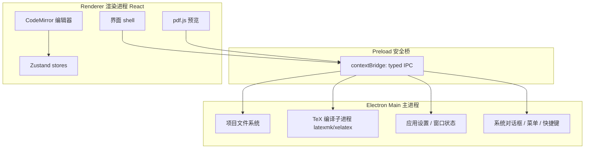

# Papex Writer 项目方案

> 论文创意与编辑软件 · Papex 生态附属项目
>
> 文档状态：**v1.0 定稿（实施基线）**
> 编写日期：2026-02-18
> 上游依赖：[papex](https://github.com/Maicarons/papex) · [papex-latex](https://github.com/Maicarons/papex/tree/main/papex-latex)

---

## 目录

1. [项目定位](#1-项目定位)
2. [目标用户与核心场景](#2-目标用户与核心场景)
3. [功能范围](#3-功能范围)
4. [与 Papex 生态的关系](#4-与-papex-生态的关系)
5. [技术选型](#5-技术选型)
6. [界面设计规范](#6-界面设计规范)
7. [系统架构](#7-系统架构)
8. [数据模型](#8-数据模型)
9. [papex-latex 集成](#9-papex-latex-集成)
10. [仓库与目录结构](#10-仓库与目录结构)
11. [文档体系（VitePress）](#11-文档体系vitepress)
12. [工程化与质量保障](#12-工程化与质量保障)
13. [打包与发布](#13-打包与发布)
14. [里程碑计划](#14-里程碑计划)
15. [风险与对策](#15-风险与对策)
16. [验收标准](#16-验收标准)

---

## 1. 项目定位

**Papex Writer** 是 Papex 学术文献平台的**桌面端论文创作与编辑工具**。它面向「从灵感 → 大纲 → 正文 → 可编译稿件 → Papex 投稿包」的完整写作链路，以 **papex-latex** 为唯一的排版与构建契约，输出与 Papex 平台完全兼容的 `submission.tar.gz`。

一句话定位：

> **本地优先的学术写作工作台**——创意收集、结构编排、LaTeX 精编、实时预览、一键导出 Papex 投稿包。

### 1.1 设计原则

| 原则 | 含义 |
|------|------|
| **契约一致** | 一切元数据以 `papex.json`（schema v1.0.0）为唯一真相源，不另造私有格式 |
| **本地优先** | 创作数据全部落在本地项目目录；不登录也能完整写作与导出 |
| **界面同源** | 设计令牌、组件形态、交互密度与 papex 网页端保持同一视觉语言 |
| **可离线编译** | 依赖本机 TeX Live / MiKTeX 完成 PDF 构建，不强制云端 |
| **Win10 基线** | Electron 支持 Windows 10 及以上；macOS / Linux 作为并行一等公民 |

### 1.2 非目标（明确不做）

- 不做 Papex 平台的管理/审核/运营功能（用网页端）
- 不做通用 Markdown 笔记软件（专注学术论文创作）
- 不做云端实时协作（v1 单机；协作留给 papex co-review）
- 不内置 LLM 云服务（可选本地 AI 接口留扩展点，见 P2）

---

## 2. 目标用户与核心场景

### 2.1 目标用户

1. **研究生 / 科研人员**：需要反复打磨论文结构、写完整 LaTeX 稿并投 Papex 或导出
2. **课程论文 / 学位论文作者**：依赖 papex.cls 中英混排模板快速出规范 PDF
3. **Papex 平台作者**：已在网页端 Writespace 写过草稿，希望有更强的桌面编辑体验

### 2.2 核心场景（用户旅程）


| 场景 | 关键能力 |
|------|----------|
| 灵感碎片管理 | 创意收件箱、标签、关联到章节 |
| 论文结构设计 | 章节树拖拽、大纲视图、模板骨架一键生成 |
| 正文精修 | LaTeX 编辑器、snippet 插入、跳转大纲、查找替换 |
| 引用管理 | BibTeX 库、`\cite{}` 补全、DOI/arXiv 导入元数据 |
| 版式打磨 | 一键编译、PDF 并排预览、错误日志定位 |
| 交付导出 | papex 投稿包、纯 PDF、纯源码 zip |

---

## 3. 功能范围

优先级：P0 = 首个可用版本必须具备；P1 = 1.x 完善；P2 = 后续探索。

### 3.1 P0 —— 创作与编辑核心

| 模块 | 功能点 |
|------|--------|
| **项目管理** | 新建/打开/最近项目；项目 = 一个含 `papex.json` + `sections/` 的本地目录；自动保存与崩溃恢复 |
| **创意库** | 灵感收件箱、标签、检索；把灵感「升格」为章节草稿或大纲节点 |
| **大纲 / 章节树** | 章节增删、拖拽排序、层级（section/subsection）；与 `papex.json.sections[]` 双向同步 |
| **LaTeX 编辑器** | CodeMirror 6；LaTeX 高亮、括号匹配、折叠、多光标、查找替换、跳转大纲 |
| **元数据编辑** | 标题/摘要/关键词/作者/机构/分类/许可/DOI/venue——对应 `papex.json` 全字段 |
| **参考文献** | 文献库 CRUD、BibTeX 导入导出、cite key 补全、`\cite{}` 一键插入 |
| **编译与预览** | 调用本机 `latexmk`/`xelatex`+`biber`；PDF 预览（pdf.js）；错误面板点击跳转源行 |
| **导出** | 生成 `submission.tar.gz`（papex.json + sections + _papex_*.tex + references.bib + papex-template.tex + papex.cls）；导出 PDF |
| **设计系统** | papex 同款 tokens / 组件 / 深浅色主题 / 中英界面 |

### 3.2 P1 —— 效率增强

| 模块 | 功能点 |
|------|--------|
| 模板与 snippet | 公式/表格/图/定理环境插入面板；用户自定义 snippet |
| 引用增强 | Crossref / arXiv DOI 元数据抓取（可选联网）；GB/T 7714 / APA 预览 |
| 版本快照 | 本地时间线快照、差异对比、一键回滚 |
| 写作统计 | 字数/页数/章节字数分布/写作时长 |
| 图表资源 | 项目内图片库、拖入即插入 `\includegraphics` |
| i18n | 界面完整 zh-CN / en-US，与 papex 文案对齐 |
| 启动体验 | 最近项目、工作区恢复、系统托盘可选 |

### 3.3 P2 —— 生态与智能

| 模块 | 功能点 |
|------|--------|
| Papex 云对接 | 用 API Key 拉取分类树、提交投稿包、同步草稿 |
| AI 辅助构思 | 本地/自定义端点：贡献点提炼、章节提纲建议、摘要润色（离线可关） |
| 全文检索 | 项目内全文检索（MiniSearch / tantivy-wasm） |
| 插件雏形 | snippet 包、模板包、导出器扩展点 |

---

## 4. 与 Papex 生态的关系

```text
                    ┌─────────────────────┐
                    │   Papex 平台 (Web)   │
                    │  文献库 / 投稿 / 同行 │
                    └──────────▲──────────┘
                               │ submission.tar.gz
                               │ （papex.json 契约）
                    ┌──────────┴──────────┐
                    │   Papex Writer      │
                    │  桌面创作与编辑      │
                    └──────────▲──────────┘
                               │ 调用模板与构建语义
                    ┌──────────┴──────────┐
                    │   papex-latex       │
                    │  papex.cls / schema │
                    │  / 构建片段生成      │
                    └─────────────────────┘
```

| 上游资产 | 在 Writer 中的使用方式 |
|----------|------------------------|
| `papex.schema.json` | 项目元数据校验的唯一 Schema（AJV） |
| `papex.cls` / `papex-template.tex` | 内置为应用资源；编译与导出时写入项目 |
| `papex-build.py` 的片段生成语义 | 移植为 TypeScript（`@papex-writer/latex-core`），生成 `_papex_*.tex` / `references.bib` |
| papex 网页 Writespace 的 `latex-gen.ts` | **直接对齐/复用**其转义与片段生成算法（单遍转义），保证导出物与网页端字节级语义一致 |
| papex UI（globals.css / shadcn） | 设计令牌与组件风格 1:1 对齐 |

**兼容承诺**：Writer 导出的 `submission.tar.gz` 必须可被 Papex 平台 `submit/archive` 流程直接接受，且本地编译结果与 papex-latex 示例包一致。

---

## 5. 技术选型

### 5.1 总览

| 层 | 选型 | 版本基线 | 理由 |
|----|------|----------|------|
| 桌面壳 | **Electron** | 33.x（支持 Win10+） | 用户明确要求；Win10 是最低系统。Electron 23+ 即不再支持 Win7/8，33 仍完整支持 Win10/11 |
| 打包 | electron-builder | 25.x+ | NSIS/MSI、DMG、AppImage 成熟 |
| 渲染层 | **React 19 + TypeScript 5.9** | 与 papex 同款 | 组件生态与 papex 可直接复用 |
| 构建 | Vite 6 + electron-vite | — | 开发 HMR 快，与 VitePress 共享工具链心智 |
| 样式 | **Tailwind CSS 4** | 4.x | 与 papex 同款 CSS 变量令牌 |
| 组件 | shadcn/ui 模式（Radix + CVA + tailwind-merge） | Radix 1.x | 与 papex `src/components/ui` 同构，便于抄齐 |
| 图标 | lucide-react | 与 papex 同款 | |
| 状态 | Zustand | 5.x | 轻量、适合编辑器会话状态 |
| 编辑器 | **CodeMirror 6** | 6.x | 比 Monaco 更轻、LaTeX 扩展灵活、无障碍更好 |
| PDF 预览 | pdf.js（`pdfjs-dist`） | 4.x | 跨平台一致、可自定义工具栏 |
| 校验 | Zod + AJV | Zod 4 / AJV 8 | Zod 管运行时对象；AJV 管 `papex.schema.json` |
| 测试 | Vitest + Playwright | 与 papex 同款 | 单测 + e2e |
| 文档 | **VitePress** | 1.6+ | 用户明确要求，与 papex docs 一致 |
| Lint/Format | ESLint 9 + Prettier 3 | 与 papex 同款 | |
| i18n | 自研轻量字典（对齐 papex `i18n` 结构） | — | 中英双语 |

### 5.2 Electron 版本与 Win10 策略

- **最低系统**：Windows 10（x64）/ macOS 11+ / Linux（glibc 现代发行版）
- **Electron 33.x**：Chromium 130 级，仍支持 Windows 10；若后续 Electron 丢弃 Win10，锁定最后支持版本并维护安全补丁分支
- 安装包：NSIS（用户级）+ MSI（企业）；`nsis.perMachine` 可选
- WebView2 不适用（Electron 自带 Chromium），无 Win10 WebView2 依赖问题

### 5.3 本地 TeX 依赖

| 依赖 | 探测 | 降级 |
|------|------|------|
| TeX Live / MiKTeX（`xelatex`、`biber`、`latexmk`） | 启动时 PATH 探测 + 设置页手动指定 | 无 TeX 时仍可编辑与导出 tar.gz；编译按钮提示安装指引 |
| 中文字体 | `build.fontset` 默认 `windows`（Win）/ `mac` / `fandol` | 与 papex.cls 选项一致 |

---

## 6. 界面设计规范

**风格锚点**：与 papex 网页端同源——沉稳靛蓝学术工作台。参考气质 = Linear / Notion 的密度克制 + papex 品牌蓝 + 学术出版的清晰排版。

### 6.1 色彩（与 papex `globals.css` 1:1）

| 令牌 | Light | Dark | 用途 |
|------|-------|------|------|
| `--background` | `0 0% 100%` | `222 47% 7%` | 应用底 |
| `--foreground` | `222 47% 11%` | `210 40% 96%` | 正文 |
| `--primary` | `224 76% 40%` | `217 91% 65%` | 主操作、选中、链接 |
| `--secondary` | `217 91% 60%` | `217 91% 60%` | 次强调 |
| `--muted` | `214 100% 97%` | `217 33% 17%` | 面板底、次级块 |
| `--accent` | `214 100% 95%` | `217 33% 20%` | hover |
| `--cta` | `142 71% 45%` | `142 71% 50%` | 「编译」「导出」等主 CTA |
| `--destructive` | `0 72% 51%` | 同左 | 危险操作 |
| `--border` / `--input` | `214 32% 91%` | `217 33% 22%` | 分割与输入框 |
| `--radius` | `0.6rem` | 同左 | 全局圆角 |

品牌辅助色（PDF/图表）：`papexblue #1D4E89`、`papexgrey #6E747C`、`papexline #C8CDD4`（与 `papex.cls` 一致）。

### 6.2 字体

| 用途 | 字体 |
|------|------|
| UI 正文 | `Open Sans`（`--font-sans`） |
| UI 标题 | `Poppins`（`--font-heading`） |
| 中文回退 | `ui-sans-serif, "Microsoft YaHei", "PingFang SC"` |
| 编辑器等宽 | `JetBrains Mono`, `Cascadia Code`, `Consolas` |

### 6.3 布局系统

```text
┌──────────────────────────────────────────────────────────────┐
│  标题栏 / 工具栏（项目名 · 保存态 · 编译 · 导出 · 主题）          │
├──────────┬───────────────────────────────────┬───────────────┤
│ 左侧导航  │           主工作区                  │   右侧检查器   │
│ 240–280px│  （编辑器 / 创意库 / 元数据 / 文献）  │  280–360px    │
│          │                                   │ 大纲/预览/引用 │
│ · 项目   │                                   │               │
│ · 创意库 │                                   │               │
│ · 章节树 │                                   │               │
│ · 文献库 │                                   │               │
│ · 设置   │                                   │               │
└──────────┴───────────────────────────────────┴───────────────┘
```

- **栅格**：侧栏固定宽 + 主区弹性；最小窗口 1100×700，推荐 1440×900
- **间距节奏**：4px 基数；面板内边距 16px；区块间距 24px
- **密度**：列表行高 36px；工具栏按钮 `size=sm`；学术工具「信息密度优先」
- **分割**：`--border` 1px 分割线，可拖拽调节侧栏宽度

### 6.4 关键界面

| 界面 | 说明 |
|------|------|
| **欢迎页** | 最近项目卡片、新建（空白 / 从 papex-latex 模板 / 从 tar.gz 导入）、打开文件夹 |
| **工作台** | 三栏布局；编辑器为核心；右侧可切换「大纲 / PDF / 引用 / 检查器」 |
| **创意库** | 卡片流 + 标签筛选；「插入到章节」一键 |
| **元数据** | 分组表单（论文 / 作者 / 构建选项），实时校验 schema |
| **文献库** | 表格式列表 + 详情抽屉；cite key 高亮 |
| **编译面板** | 进度条、日志流、错误列表（点击跳行）、PDF 预览 |
| **导出向导** | 预检清单 → 产物预览 → 生成 tar.gz / PDF |

### 6.5 组件与交互

- 完整沿用 papex `ui/*`：Button / Input / Textarea / Select / Tabs / Card / Badge / Dialog / Dropdown / Switch / Tooltip / Separator / Skeleton / Avatar
- 交互：编译中 CTA 禁用并显示 spinner；自动保存 400ms 防抖（对齐 Writespace）；破坏性操作二次确认
- 深浅色：`class` 策略（同 papex），跟随系统 + 手动切换
- 动效：`fade-in` / `accordion` 等 papex 同款 keyframe，克制使用

---

## 7. 系统架构

### 7.1 进程模型



**安全基线**：`contextIsolation: true`、`nodeIntegration: false`、仅暴露白名单 IPC；文件读写走主进程路径校验（限制在项目根内）。

### 7.2 模块划分

| 模块 | 位置 | 职责 |
|------|------|------|
| `app-shell` | `src/renderer/shell` | 布局、侧栏、工具栏、主题、i18n |
| `project` | `src/{main,renderer}/project` | 项目打开/保存、目录监视、最近列表 |
| `ideation` | `src/renderer/features/ideation` | 创意库、标签、升格为章节 |
| `outline` | `src/renderer/features/outline` | 章节树 ↔ papex.json.sections |
| `editor` | `src/renderer/features/editor` | CodeMirror、snippet、跳转 |
| `meta` | `src/renderer/features/meta` | 元数据表单 + schema 校验 |
| `refs` | `src/renderer/features/refs` | 文献库、BibTeX、cite 补全 |
| `compile` | `src/main/tex` + `renderer/features/compile` | 编译任务队列、日志、PDF 产物 |
| `export` | `src/main/export` + `renderer/features/export` | tar.gz / PDF / zip |
| `latex-core` | `packages/latex-core` | 转义、片段生成、归档组装、schema |

### 7.3 编译流水线

```text
编辑器内容 (内存) ──保存──► 项目目录 papex.json + sections/*.tex
                              │
                              ▼
                    latex-core.generateArtifacts()
                    _papex_meta.tex / abstract / sections /
                    backmatter / appendices / references.bib
                              │
                              ▼
                    主进程 spawn: latexmk -xelatex papex-template.tex
                              │
                              ▼
                    build/papex-template.pdf ──► pdf.js 预览
```

- 编译输出隔离在 `<project>/.papex-writer/build/`，不污染源码
- 使用 `latexmkrc`（对齐 papex-latex）：`$pdf_mode = 5`（xelatex）、biber 链路
- 禁用 `--shell-escape`（安全）

### 7.4 状态流

- **ProjectStore**：当前项目路径、manifest、文件映射、脏标记
- **EditorStore**：当前章节、光标、打开标签、撤销（编辑器内部）
- **IdeationStore**：创意列表、过滤器
- **RefsStore**：文献条目、当前库路径
- **CompileStore**：任务状态、日志、错误、pdf 版本号
- **SettingsStore**：主题、语言、TeX 路径、自动保存、字号

持久化：项目数据 = 项目目录文件；应用设置 = `electron-store`（或 JSON）放在 userData。

---

## 8. 数据模型

### 8.1 项目目录（磁盘真相源）

```text
my-paper/
├── papex.json                 # 契约清单（schema v1.0.0）
├── papex-template.tex         # 可被 build 选项改写
├── references.bib             # 可选（json 内 references 优先）
├── sections/
│   ├── 00-intro.tex
│   ├── 01-method.tex
│   └── ...
├── assets/                    # 图片等
├── .papex-writer/
│   ├── project.json           # Writer 私有：创意库、UI 状态、快照索引
│   ├── build/                 # 编译输出（gitignore）
│   └── snapshots/             # 版本快照
└── submission.tar.gz          # 导出产物（可选）
```

### 8.2 `papex.json`

严格遵循上游 `papex.schema.json`（draft-07），字段详见该 Schema。Writer 额外约定：

- `schemaVersion` 固定校验为 `1.0.0`
- `build.fontset` 默认值随平台探测填入（windows/mac/ubuntu/fandol）
- 章节 `file` 路径统一 `/` 分隔，限制在项目根内

### 8.3 Writer 私有扩展（`.papex-writer/project.json`）

```jsonc
{
  "writerVersion": "0.1.0",
  "ideas": [
    {
      "id": "uuid",
      "title": "…",
      "body": "…",
      "tags": ["method", "todo"],
      "status": "inbox" | "linked" | "archived",
      "targetSectionId": "01-method", // 可空
      "createdAt": "ISO-8601",
      "updatedAt": "ISO-8601"
    }
  ],
  "ui": { "sidebarWidth": 260, "activeRightTab": "outline", "openSections": ["00-intro"] },
  "snapshots": [{ "id": "uuid", "label": "v1 初稿", "createdAt": "ISO-8601" }]
}
```

该文件**不进入**投稿包，避免污染 Papex 契约。

---

## 9. papex-latex 集成

### 9.1 资源内置

| 文件 | 来源 | 内置位置 |
|------|------|----------|
| `papex.cls` | `papex-latex/papex.cls` | `resources/latex/papex.cls` |
| `papex-template.tex` | 同上 | `resources/latex/papex-template.tex` |
| `papex.schema.json` | 同上 | `resources/latex/papex.schema.json` |
| `latexmkrc` | 同上 | `resources/latex/latexmkrc` |
| `example/` | 同上 | `resources/latex/example/`（「从示例新建」） |

升级策略：`scripts/sync-latex.mjs` 从 papex 仓库（submodule 或指定 tag）同步资源并比对 diff。

### 9.2 构建语义（`packages/latex-core`）

与 papex 网页 `src/lib/writespace/latex-gen.ts` **同构移植**（TypeScript，零运行时依赖）：

| API | 对齐上游 | 说明 |
|-----|----------|------|
| `latexEscape` / `bibtexEscape` | 单遍字符扫描 | 严禁二次转义 |
| `genMeta` | `genMeta` | title/author/affil/keywords/license… |
| `genAbstract` / `genSections` / `genBackmatter` / `genAppendices` | 同名 | 生成 `_papex_*.tex` |
| `genBib` | `genBib` | references 数组 → BibTeX |
| `applyTemplateOptions` | 同名 | bibStyle / columns 注入 documentclass |
| `buildArchiveFiles` | 同名 | 完整归档文件清单 |
| `validateManifest` | （新增） | AJV + `papex.schema.json` |
| `createTarGz` | tar-gzip 实现 | 导出 submission.tar.gz |

**测试契约**：与 papex-latex `example/` 在相同输入下，生成的 `_papex_*.tex` / `references.bib` 快照测试完全一致。

### 9.3 本地编译

```ts
// 主进程伪代码
spawn(latexmkPath, ["-xelatex", "-interaction=nonstopmode", "papex-template.tex"], {
  cwd: buildDir,
  env: sanitizedEnv, // 无 shell-escape
});
```

- 超时与取消；输出解析为 `{ file, line, level, message }` 列表
- 错误行号映射回原始 `sections/*.tex`（借助 `#line` 或文件名匹配）

---

## 10. 仓库与目录结构

采用 **GitHub 开源项目标准结构**，单仓库（不强制 monorepo workspace，但 `packages/` 独立可测）：

```text
papex-writer/
├── .github/
│   ├── ISSUE_TEMPLATE/
│   │   ├── bug_report.yml
│   │   └── feature_request.yml
│   ├── PULL_REQUEST_TEMPLATE.md
│   └── workflows/
│       ├── ci.yml                 # lint + typecheck + unit + build
│       ├── docs.yml               # VitePress 构建部署 GitHub Pages
│       └── release.yml            # tag → electron-builder 多平台
├── docs/                          # VitePress 文档站
│   ├── .vitepress/
│   │   ├── config.ts
│   │   └── theme/                 # 可选自定义主题
│   ├── public/
│   │   └── logo.svg
│   ├── index.md                   # 首页
│   ├── guide/
│   │   ├── getting-started.md
│   │   ├── ideation.md            # 创意工作流
│   │   ├── editing.md             # 编辑与章节
│   │   ├── references.md
│   │   ├── compile.md
│   │   ├── export.md
│   │   └── templates.md
│   ├── reference/
│   │   ├── papex-json.md
│   │   ├── keyboard.md
│   │   ├── architecture.md
│   │   └── cli.md
│   └── zh/                        # 中文镜像（与 papex docs 语言布局一致）
│       ├── index.md
│       └── guide/…
├── packages/
│   ├── latex-core/                # papex-latex 语义移植
│   │   ├── src/
│   │   │   ├── escape.ts
│   │   │   ├── generate.ts
│   │   │   ├── archive.ts
│   │   │   ├── validate.ts
│   │   │   └── index.ts
│   │   ├── test/
│   │   ├── package.json
│   │   └── tsconfig.json
│   └── shared/                    # 跨进程类型、常量、i18n 字典
│       ├── src/
│       │   ├── types.ts
│       │   ├── ipc.ts
│       │   └── i18n/
│       └── package.json
├── src/
│   ├── main/                      # Electron 主进程
│   │   ├── index.ts
│   │   ├── window.ts
│   │   ├── menu.ts
│   │   ├── ipc/
│   │   ├── project/
│   │   ├── tex/
│   │   └── export/
│   ├── preload/
│   │   └── index.ts
│   └── renderer/
│       ├── index.html
│       ├── main.tsx
│       ├── App.tsx
│       ├── shell/
│       ├── components/ui/         # 与 papex 同构的 shadcn 组件
│       ├── features/
│       │   ├── welcome/
│       │   ├── ideation/
│       │   ├── outline/
│       │   ├── editor/
│       │   ├── meta/
│       │   ├── refs/
│       │   ├── compile/
│       │   └── export/
│       ├── stores/
│       ├── styles/globals.css     # papex 设计令牌
│       └── lib/
├── resources/
│   ├── icon/
│   └── latex/                     # papex.cls / template / schema / example
├── scripts/
│   ├── sync-latex.mjs
│   └── verify-example.mjs
├── e2e/                           # Playwright Electron 测试
├── electron-builder.yml
├── electron.vite.config.ts
├── package.json
├── tsconfig.json
├── tsconfig.node.json
├── eslint.config.mjs
├── .prettierrc.json
├── .gitignore
├── LICENSE                        # Apache-2.0（与 papex 一致）
├── README.md
├── README_zh.md
└── PROJECT_PLAN.md                # 本文档
```

---

## 11. 文档体系（VitePress）

对齐 papex 的 docs 站布局，中英双语。

### 11.1 站点信息架构

| 分区 | 页面 |
|------|------|
| 首页 | Hero + 特性 + 快速开始 |
| 指南 | 上手、创意工作流、章节编辑、引用、编译、导出、模板 |
| 参考 | papex.json 字段、快捷键、架构、命令行 |
| 项目 | 关于、路线图、许可、与 papex 的关系 |

### 11.2 配置要点

```ts
// docs/.vitepress/config.ts（摘要）
export default defineConfig({
  title: "Papex Writer",
  description: "Papex 论文创意与编辑软件",
  themeConfig: {
    logo: "/logo.svg",
    nav: [
      { text: "指南", link: "/guide/getting-started" },
      { text: "参考", link: "/reference/papex-json" },
      { text: "Papex", link: "https://github.com/Maicarons/papex" },
    ],
    sidebar: { /* guide + reference */ },
    socialLinks: [{ icon: "github", link: "https://github.com/Maicarons/papex-writer" }],
  },
  locales: {
    root: { label: "English", lang: "en" },
    zh: { label: "简体中文", lang: "zh-CN", link: "/zh/" },
  },
});
```

脚本：`docs:dev` / `docs:build` / `docs:preview`（与 papex 一致）；CI 部署 GitHub Pages。

---

## 12. 工程化与质量保障

### 12.1 脚本（package.json）

| 命令 | 作用 |
|------|------|
| `dev` | electron-vite 开发（HMR + 主进程热重载） |
| `build` | 类型检查 + 渲染/主进程打包 |
| `pack` / `dist` | electron-builder 本地打包 / 发布产物 |
| `lint` / `format` / `typecheck` | ESLint / Prettier / tsc --noEmit |
| `test` / `test:watch` | Vitest 单测（含 latex-core 契约测试） |
| `e2e` | Playwright（Electron） |
| `docs:dev/build/preview` | VitePress |
| `sync:latex` | 同步 papex-latex 资源 |
| `verify:example` | 与上游 example 构建结果比对 |

### 12.2 测试策略

| 层 | 工具 | 覆盖 |
|----|------|------|
| 单元 | Vitest | latex-core 转义/片段/归档、schema 校验、stores |
| 组件 | Vitest + Testing Library | 表单校验、大纲树、错误面板 |
| 契约 | 快照测试 | 与 papex `latex-gen` 输出一致性 |
| e2e | Playwright | 新建项目→写作→编译 mock→导出 tar.gz 全链路 |
| 手动 | 清单 | Win10 真机安装、TeX Live 2024/2025、深浅色 |

### 12.3 CI 矩阵

- **ci.yml**：Ubuntu / Windows / macOS × Node 20；lint → typecheck → unit → build
- **release.yml**：tag `v*` → 三平台构建 → 附到 GitHub Release（含 `latest.yml` 供自动更新）
- **docs.yml**：docs 变更 → VitePress build → Pages

### 12.4 代码规范

- TypeScript `strict: true`
- ESLint 9 flat config + `eslint-config-next` 等价规则集（无 Next 时用 typescript-eslint）
- Prettier + `prettier-plugin-tailwindcss`
- Commit：Conventional Commits（`feat: fix: docs: chore:`）
- PR 模板 + Issue 模板齐全

---

## 13. 打包与发布

### 13.1 electron-builder 要点

```yaml
appId: dev.papex.writer
productName: Papex Writer
copyright: Copyright 2026 The Papex Authors
directories: { output: dist, buildResources: resources }
files: [dist/**, resources/**, package.json]
win:
  target: [nsis, msi]
  minimumSystemVersion: "10.0.0"
  icon: resources/icon/icon.ico
nsis:
  oneClick: false
  perMachine: false
  allowToChangeInstallationDirectory: true
mac:
  target: [dmg, zip]
  category: public.app-category.productivity
linux:
  target: [AppImage, deb]
  category: Office
```

### 13.2 发布物

| 平台 | 产物 | 系统要求 |
|------|------|----------|
| Windows | `Papex-Writer-Setup-x.x.x.exe`、`.msi` | Windows 10 x64+ |
| macOS | `.dmg`、`.zip` | macOS 11+ |
| Linux | `.AppImage`、`.deb` | 现代 glibc |

- 代码签名：Windows Authenticode / macOS Developer ID（发布阶段配置 secrets）
- 自动更新：`electron-updater` + GitHub Releases（可选开关）
- 许可证：Apache-2.0

---

## 14. 里程碑计划

| 里程碑 | 版本 | 内容 | 出口标准 |
|--------|------|------|----------|
| **M0 蓝图** | 0.0.x | 本文方案、仓库骨架、git、docs 骨架、CI 空转 | 方案评审通过 |
| **M1 壳与契约** | 0.1.x | Electron 壳、papex 设计令牌/组件、项目新建/打开、meta 表单、latex-core 单测通过 | 能建项目并校验 papex.json |
| **M2 写作核心** | 0.2.x | 章节树、CodeMirror 编辑器、自动保存、创意库 P0、文献库 P0 | 可完成一篇多章节草稿 |
| **M3 编译闭环** | 0.3.x | 本地 latexmk 编译、PDF 预览、错误跳转、导出 tar.gz | 导出包可被 papex 平台接受 |
| **M4 打磨发布** | 0.4.x → 1.0 | 快照、统计、snippet、i18n、安装包、文档站、e2e | Win10 安装包可分发；文档完整 |
| **M5 生态** | 1.x | Papex 云对接、引用增强、AI 辅助（可选） | 按路线图迭代 |

> 详细排期在 M0 评审后写入 GitHub Projects（Milestones + Issues）。

---

## 15. 风险与对策

| 风险 | 影响 | 对策 |
|------|------|------|
| 本机 TeX 环境缺失或版本混乱 | 无法预览 PDF | 安装向导 + 一键检测；无 TeX 仍可编辑/导出；文档提供 TeX Live/MiKTeX 指南 |
| Electron 未来放弃 Win10 | 升级受阻 | 锁定支持 Win10 的主版本；安全补丁分支；评估 Tauri 逃生舱（架构已隔离 latex-core） |
| 与 papex-latex 上游漂移 | 导出不兼容 | `sync:latex` + 契约快照测试 + CI 比对 example |
| 大文件/长文档编辑性能 | 卡顿 | CodeMirror 6 按需解析；章节按文件拆分；pdf.js 按页渲染 |
| 中英混排字体差异 | 预览与最终 PDF 不一致 | 沿用 `build.fontset` 语义；预览即编译产物，所见即所得 |
| 打包体积与杀软误报 | 分发受阻 | 官方签名；NSIS 标准脚本；提供便携版说明 |
| 本地数据误删 | 丢稿 | 自动保存、快照、`.papex-writer/build` 与源码隔离；文档提示备份 |

---

## 16. 验收标准

### 16.1 功能验收（M3 / v0.3）

- [ ] 在 Windows 10 上安装并启动，界面与 papex 视觉令牌一致（深浅色）
- [ ] 新建项目自动生成合法 `papex.json` + 示例章节
- [ ] 元数据/作者/文献编辑并通过 schema 校验（错误定位到字段）
- [ ] 多章节 LaTeX 编辑、大纲同步、自动保存后进程强杀可恢复
- [ ] 创意入库、打标签、插入到指定章节
- [ ] 一键调用本机 TeX 编译出 PDF 并预览；编译错误可点击跳转
- [ ] 导出 `submission.tar.gz`，结构与 papex-latex 提交包一致，可被 Papex 平台接受
- [ ] `packages/latex-core` 与上游 `latex-gen` 契约测试全部通过

### 16.2 工程验收

- [ ] git 仓库初始化，Conventional Commits，含 LICENSE / README / .gitignore
- [ ] `npm run lint && npm run typecheck && npm run test` 本地与 CI 全绿
- [ ] VitePress 文档站可 `docs:dev` 预览，中英导航完整
- [ ] Windows NSIS 安装包可在干净 Win10 虚拟机安装、卸载干净

### 16.3 体验验收

- [ ] 冷启动 < 3s（SSD，中配机）
- [ ] 10 章节 × 2 万字编辑不卡顿
- [ ] 键盘可达性：核心操作均有快捷键并写入文档

---

## 附录 A · 快捷键草案（P0）

| 快捷键 | 动作 |
|--------|------|
| `Ctrl/Cmd + S` | 保存项目 |
| `Ctrl/Cmd + N` | 新建章节 |
| `Ctrl/Cmd + Shift + P` | 命令面板 |
| `Ctrl/Cmd + B` | 编译当前项目 |
| `Ctrl/Cmd + E` | 导出投稿包 |
| `Ctrl/Cmd + K` | 引用/命令快速插入 |
| `Ctrl/Cmd + /` | 注释切换（编辑器） |
| `Ctrl/Cmd + F` / `H` | 查找 / 替换 |

## 附录 B · 与 papex 网页 Writespace 的差异

| 维度 | Writespace（网页） | Papex Writer（桌面） |
|------|-------------------|---------------------|
| 运行环境 | 浏览器 + Papex 服务端 | Electron 本地 |
| 存储 | localStorage 草稿 + 云端投稿 | 项目目录文件系统 |
| 编辑器 | 文本域级 | CodeMirror 6 专业编辑 |
| 编译 | 仅导出 tar.gz（服务端编译） | 本地 latexmk 实时预览 |
| 创意/大纲 | 无 | 一等公民 |
| 元数据契约 | papex.json | **同一契约** |

---

## 附录 C · 参考资料

- Papex 仓库：<https://github.com/Maicarons/papex>
- papex-latex README：`papex-latex/README.md`
- papex.json Schema：`papex-latex/papex.schema.json`
- papex 网页构建语义：`src/lib/writespace/latex-gen.ts`
- papex 设计令牌：`src/app/globals.css`
- Electron 支持策略：Electron 官网 Supported Platforms（Win10+）
